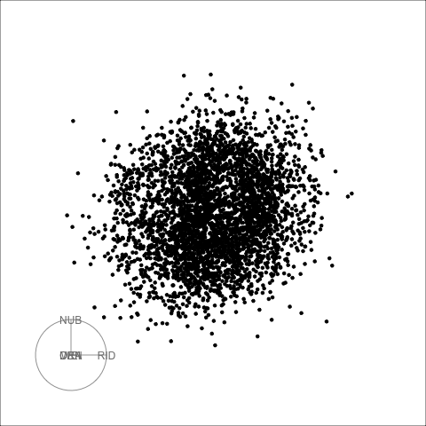

```{r titleslide, child="components/titleslide.Rmd"}
```

```{r setup, include = FALSE}
options(width = 600)
library(tidyverse)
filter <- dplyr::filter

library(tourr)
library(plotly)
library(htmltools)
```


---
## Reminder: talk by Di Cook two years ago

<br><br>


  
  
--
  
  
--
  


---
## Solution: Slice tour

Define slices based on the orthogonal distance of points from any projection plane, and visualize the result in an animated tour

  

Described in [Laa, Cook, Valencia (2020)](https://doi.org/10.1080/10618600.2020.1777140)

Related work in [Laa, Cook, Buja, Valencia (2020)](https://arxiv.org/abs/2004.13327)

---
## Curse of dimensionality paradox

- **Origin**: Bellman (1961) described difficulty of optimization in high dimensions given exponential growth in space
- **Consequence**: most points are far from the sample mean, near the edge of the sample space
- **Paradox**: using dimension reduction we instead get an excessive amount of observations near the center of the distribution, most projections are approximately Gaussian

.center[
  
]

---
## Concepts of projected volume


- To understand the piling near the center of projections, we can think about the high-dimensional volume projected onto a 2D area
- To impose rotation invariance and avoid edge effects, we start from a hypersphere in p dimensions

<br>

--

.center[
  
]

---
## Concepts of projected volume


- To understand the piling near the center of projections, we can think about the high-dimensional volume projected onto a 2D area
- To impose rotation invariance and avoid edge effects, we start from a hypersphere in p dimensions

<br>


.center[
  
]

---
## Burning sage transformation

We can define a radial transformation that will redistribute the projected volume such that equal pD volume is projected onto equal 2D area

$$r'_y = R \sqrt{1-\left(1-\left(\frac{r_y}{R}\right)^2\right)^{p/2}}$$

--

.center[
  
]

---
## Burning sage transformation

We can define a radial transformation that will redistribute the projected volume such that equal pD volume is projected onto equal 2D area

$$r'_y = R \sqrt{1-\left(1-\left(\frac{r_y}{R}\right)^2\right)^{p/2}}$$


.center[
  
]

---
## Sage tour

The new transformation is especially useful combined with a tour display, showing sequences of low-dimensional projections: for each new view we project the data to 2D and then show the sage display of the projected data

<br>

<iframe src="4cube.html" width="310" height="400" scrolling="no" seamless="seamless" frameBorder="0"> </iframe>
<iframe src="4sphere.html" width="310" height="400" scrolling="no" seamless="seamless" frameBorder="0"> </iframe>
<iframe src="10sphere.html" width="310" height="400" scrolling="no" seamless="seamless" frameBorder="0"> </iframe>

---
## Needle in a haystack: Pollen data

<br><br>

  

---
## Clustering in high dimensions: Single Cell Mouse Retina Data

<br>

.center[
 
]
---
## Clustering in high dimensions: Single Cell Mouse Retina Data

```{r, echo=F, warning=F, error=F, message=F, out.width="95%", fig.align="center"}
library(magick)
dir <- here::here("images/")
frames <- c("001", "016", "038", "074")
draw_frames <- function(pngs) {
  res <- lapply(pngs, image_read)
  res <- do.call("c", res)
  image_append(res)
}

draw_panel <- function(a, b) {
  whitespace <- image_blank(image_info(a)$width, 50, color = "none")
  img <- c(a, whitespace, b)
  image_append(img, stack = TRUE)
}
mouse_grand <- paste0(dir, "mouse_grand_2c-", frames, ".png")
mouse_grand_panel <- draw_frames(mouse_grand)
mouse_sage <- paste0(dir, "mouse_sage_2c_gam3-", frames, ".png")
mouse_sage_panel <- draw_frames(mouse_sage)

mouse <- draw_panel(mouse_grand_panel, mouse_sage_panel)
mouse
```

---
## Discussion & Outlook

<br>

- We introduced a new display that is useful when visualizing high-dimensional data in low-dimensional projections
- This is especially useful in combination with a tour, implemented as the **sage tour** display
- A related approach is the **slice tour**
- These new displays are complementary to non-linear dimension reduction methods for visualization, e.g. t-SNE
- The displays should be implemented in an interactive interface for efficient tuning
- We can also think of new transformation and slicing methods

